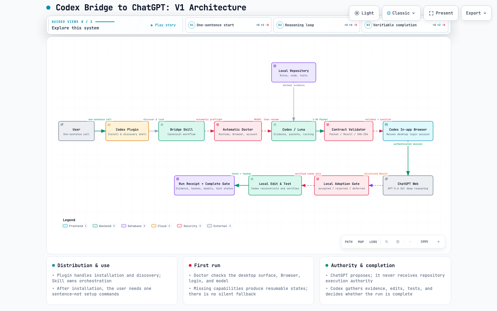

# Universal Agent Bridge (`universal-agent-bridge`)

**English** | [简体中文](README.zh-CN.md)

> **Special Acknowledgement & Upstream Heritage**:
> This project is originally forked and evolved from the pioneering work [anightmonarch/codex-bridge-chatgpt](https://github.com/anightmonarch/codex-bridge-chatgpt). We express our highest gratitude to `@anightmonarch` for establishing the foundational reasoning handoff paradigm.
> 
> In **Universal Agent Bridge**, we have comprehensively expanded and upgraded this paradigm:
> 1. **Multi-Model Web Matrix**: Extended from ChatGPT-only to supporting **ChatGPT, Claude, DeepSeek, Google Gemini, Grok, Qwen (通义千问), Doubao (豆包), GLM (智谱清言), and Kimi**.
> 2. **Universal Agent Framework**: Decoupled from OpenAI Codex Desktop to run on **DeepSeek Harness, Claude Code, Cursor, OpenCode, CLI Agents, and Custom Workflows**.
> 3. **Dual-Channel High Availability Transport**: Supports both native WebSocket and Tampermonkey Userscript HTTP Long-Polling (`GM_xmlhttpRequest`), 100% immune to browser CSP and Mixed Content blocks.

[](LICENSE)
[](package.json)
[](https://greasyfork.org/zh-CN/scripts/593912-universal-agent-bridge-multi-model-coding-matrix)



---

## Installation

### Step 1: Clone Repository into your Agent's Skills Directory

Clone this project into your AI Agent's designated skills folder (e.g. `~/.dsh/skills`, `~/.codex/skills`, or workspace root):

```bash
# Clone the repository
git clone https://github.com/EasongChung/Universal-Agent-Bridge.git universal-agent-bridge

# Enter directory and run health check
cd universal-agent-bridge
npm run doctor
```

### Step 2: Install the Browser Bridge Userscript (or Extension)

- **One-Click Install Userscript (GreasyFork Official)**:
  👉 **[Universal-Agent-Bridge on GreasyFork](https://greasyfork.org/zh-CN/scripts/593912-universal-agent-bridge-multi-model-coding-matrix)**
- *Alternative (Native Browser Extension)*:
  Load the unpacked folder `browser/extension/` directly into Edge or Chrome `edge://extensions` / `chrome://extensions`.

### Step 3: Log In to Your Preferred Platforms in Default Browser

Open and log in to the platforms you plan to use in your default browser:
- 🟢 **Claude**: `https://claude.ai`
- 🟢 **DeepSeek**: `https://chat.deepseek.com`
- 🟢 **Gemini**: `https://gemini.google.com`
- 🟢 **ChatGPT**: `https://chatgpt.com`
- 🟢 **Grok**: `https://grok.com`
- 🟢 **Qwen (通义千问)**: `https://tongyi.aliyun.com` or `https://chat.qwen.ai`
- 🟢 **Doubao (豆包)**: `https://www.doubao.com`
- 🟢 **GLM (智谱清言)**: `https://chatglm.cn`
- 🟢 **Kimi**: `https://www.kimi.com`

---

## Quick start

When the Agent triggers the skill:
1. It automatically starts the local Bridge transport service;
2. It prompts or lets you choose which platform to use (e.g., DeepSeek, Claude, ChatGPT, Gemini, Grok, or Auto);
3. It launches your default browser, navigates to the selected platform, establishes a live handshake, and begins reasoning.

```bash
# 1. Start the Bridge transport server
node skills/universal-agent-bridge/scripts/ws-transport.mjs serve

# 2. Check connected Web AI platforms
node skills/universal-agent-bridge/scripts/ws-transport.mjs status

# 3. Send Context Packet (Auto-routed or specify target platform)
node skills/universal-agent-bridge/scripts/ws-transport.mjs send packet.md result.md
node skills/universal-agent-bridge/scripts/ws-transport.mjs send packet.md result.md --platform claude
node skills/universal-agent-bridge/scripts/ws-transport.mjs send packet.md result.md --platform deepseek
```

### OpenAI-Compatible API Mode

Use the bridge as an OpenAI-compatible LLM API server for any OpenAI SDK client:

```bash
# Start OpenAI-compatible API server
npm run api
# or
node skills/universal-agent-bridge/scripts/openai-api.mjs serve --port 8765 --api-key sk-bridge-local-key

# List available models
curl http://localhost:8765/v1/models -H "Authorization: Bearer sk-bridge-local-key"

# Chat completions
curl http://localhost:8765/v1/chat/completions \
  -H "Authorization: Bearer sk-bridge-local-key" \
  -H "Content-Type: application/json" \
  -d '{"model": "chatgpt-web", "messages": [{"role": "user", "content": "Hello!"}]}'
```

See [OpenAI API Documentation](skills/universal-agent-bridge/references/openai-api.md) for full usage with Python/Node.js SDKs.

---

## How it works

```
  ┌────────────────────────────────────────────────────────────────────────┐
  │                           Local AI Agent                               │
  │     (DeepSeek Harness, Claude Code, Cursor, OpenCode, Terminal CLI)    │
  └──────────────────┬─────────────────────────────────▲───────────────────┘
                     │ 1. Collect sanitized evidence   │ 4. Verify & test locally
                     │    & construct bounded packet   │    (zero authority leak)
                     ▼                                 │
  ┌────────────────────────────────────────────────────────────────────────┐
  │                 Local Bridge Transport (Port 8765)                     │
  │            (WebSocket + GM_xmlhttpRequest HTTP Long-Poll)              │
  └──────────────────┬─────────────────────────────────▲───────────────────┘
                     │ 2. Real-time Task Dispatch      │ 3. Structured Result
                     ▼                                 │    Extraction
  ┌────────────────────────────────────────────────────────────────────────┐
  │                   Browser Reasoning Provider Matrix                    │
  │     [Claude]      [DeepSeek]      [Gemini]      [Grok]     [ChatGPT]   │
  └────────────────────────────────────────────────────────────────────────┘
```

| Responsibility | Owner |
|---|---|
| Read workspace rules, source code, tests, and git state | Local AI Agent |
| Sanitize & strip secrets from evidence | Local AI Agent Gate |
| High-cost reasoning pass / Deep thinking | Web AI Platform (Claude, DeepSeek, Gemini, Grok, etc.) |
| Code review & adoption verification | Local AI Agent |
| Modify repository files & execute tests | Local AI Agent |

---

## Workflow

1. **Preflight Health Check**: Run `node skills/universal-agent-bridge/scripts/doctor.mjs --json`.
2. **Context Packet Construction**: Gather evidence, sanitize secrets, and build `<3000` token packet.
3. **Dispatch & Reasoning**: Send to Web AI reasoning matrix via WebSocket or Userscript long-polling.
4. **Local Verification**: Offline deterministic verification of structured Reasoning Result and local testing.
